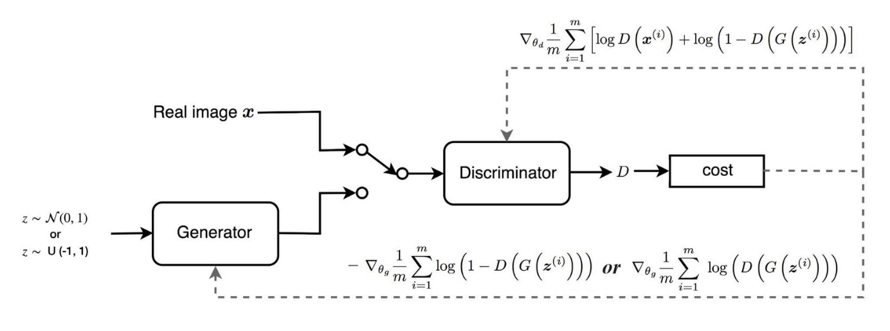

# TranBoost: Generative Image Classification

### Team
- Pablo Rodriguez Bertorello, Computer Science, Stanford University
- Liang Ping Koh, Statistics, Stanford University

### Abstract
In important prediction scenarios, data-sets are naturally imbalanced, for example in cancer detection: a small minority of people may exhibit the disease. This poses a significant classification challenge to machine learning algorithms. Data imbalance can cause lower performance for the class of interest, e.g. classifying with high precision that the person has cancer. When training data is abundant, a possible approach is to down-sample the majority class, thus restoring balance.  A prevalent approach is weighting, accelerating learning for minority class training examples, however the weighting objective must be carefully considered. Synthesis is a major alternative, producing examples of the minority class, adding them to the training set to overcome the class imbalance. The Synthetic Minority Over-sampling Technique, SMOTE is widely applied, but it was not developed for image data. Rather, this paper applies Generative Adversarial Networks, which generate image examples drawn from the minority class distribution. The novel TranBoost approach is proposed, combining a GAN image generator with an ensemble of image classifiers. The generator takes advantage of Transfer Learning, leveraging knowledge about majority classes to learn how to best generate minority examples. Thus, TranBoost outperforms SMOTE and Adaptive Synthesis for image classification in imbalanced data-sets.

### Report
For details see the project report ....

### Library
A library is published, composed of several classes implemented for plug-and-play experimentation with different GAN architectures:
- Main: searches for hyper-parameters including GAN architecture, optimizer, learning rate, batch size.  For experiment reproduce-ability, it sets random seeds 
- Data: pre-configured data-sets include CIFAR10 and MNIST. It includes methods to selects the classes of interest from a given dataset, performing data normalization and augmentation
- Augmentation: Flip, Crop, GaussianBlur, ContrastNormalization, AdditiveGaussianNoise, Multiply, Afine
- Architecture: pre-loaded GAN architectures include Brownlee and Atienza. Adding new architectures takes few minutes, by simply specifying the corresponding Sequence file 
- Loss: As necessary, different loss functions can be utilized, with examples provided: GAN, WGAN, LSGAN, DRAGAN, HINGE
- Adversarial: instantiates a Discriminator network with a D neural net in it, and a Generator network with a G and the same D networks in it. The learning rate is set lower for the Discriminator, to ease training convergence
- Trainer: concurrently trains the GAN's Generator and Discriminator, tracks metrics, saves logs.  Depending on configuration, it dynamically adapts learning rate, and calls for early termination of training 
- Sequence: can be instantiated to either build Generator or a Distributor model.  It is able to transfer learning  from a pre-existing model. And it can adapt during training by swapping its optimizer and learning rate 
- Optimizer: is a factory that includes Adam and RMSProp, where few lines of code are required to add addititional optimizers 
- Configuration: folders used for models, logs, images generated, data-sets, sampled data-sets. Also training settings like number of steps, thresholds for adaptation and termination
- Util: useful methods for folder creation, plotting single and grids of images, logging 

